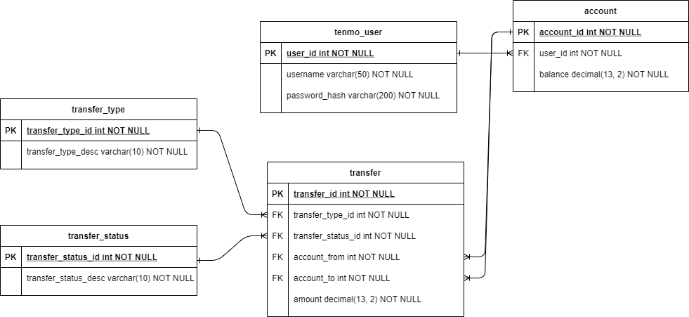

This is a 'venmo' esque type of application built using Spring and utilizes the MVC pattern.\
Each transfer has 2 types, send or request.\
Each transfer has 3 statuses, approved, rejected or pending.\
Send transfers are automatically approved if the user has enough funds, or are set to pending if not.\
Request transfers are automatically set to pending. The request can then be approved once you log in to the other user.

All calculations are done by sending HTTPRequests to the REST API. The front end is used to validate user input and send it to the API.\
Calculations are done from the TransferService class where the different accounts' balance is updated in the DB.

## REST API endpoints. all requests start with ~/users/

### User
`/` **GET**
> Returns all users in the DB.

`/{id}` **GET**
> Finds user by user_id.

`/owner?account-id=?` **GET**
> Finds user based of account_id.

### Account
`/account?user-id=?` **GET**
> Returns all accounts by user_id.

`/account/id` **GET**
> Gets a specific account by account_id.

`/account` **PUT**
> Takes a validated account as the request body and updates the DB.

### Transfer
`/account/transfer` **POST**
> Takes a valid Transfer as the request body, and will create a transfer and update the account balances if approved.

`/account/transfer?id=?` **GET**
> Gets all transfers by account ID.

`/account/transfer?id=?&status="PENDING" or "REJECTED" or "APPROVED"` **GET**
> Gets all transfers by account ID and transfer status. Use PENDING for all pending transfers, REJECTED for all rejected, etc. Do not use "" when using status=?

`/account/transfers` **PUT**
> Takes a valid transfer and updates the DB. Will also execute transfer based off status and type.

`/account/transfers/{id}` **GET**
> Gets transfer by transfer ID.

### Login endpoints. All requests start with ~/
`/login` **POST**
> Takes a login DTO and logs in the user if authenticated.

`/register` **POST**
> Creates a new user, new users starts with 1 account with $1000 balance.

## Database schema

## How to set up the database

Make a new database called 'tenmo' in pgAdmin.\
In the database folder, you'll find the database creation scripts and a shell script called `create.sh`. Run `./create.sh` from the database folder in Bash to create the database.[^1]\
You will need to register each user to populate the DB. Every user starts with an account with $1000.\
Future implementations could have 2 seperate accounts, checking and savings for example.

[^1]: If the bash script does not work, run the three .sql files in the order of dropdb.sql, scheme.sql, user.sql